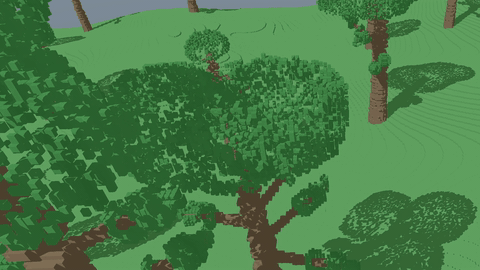

# voxel-engine-v0
SVO ray tracing engine

## layout
    src/
        main.rs

        app/
            mod.rs          // App struct: owns renderer + world + streaming + camera + input

        config.rs         // constants: chunk size, radii, voxel size, budgets

        input.rs          // KeyState, mouse look, focus/grab helpers

        camera.rs         // Camera state + uniform packing

        world/
            mod.rs
            generator.rs    // WorldGen (height noise, material query entrypoints)
            materials.rs    // material IDs + palette invariants
            trees.rs        // Tree, TreeCache, tree placement + geometry queries
            hash.rs         // hash_u32/hash2/hash3/u01

        streaming/
            mod.rs
            chunk.rs        // ChunkKey, ChunkState, ChunkCpu
            manager.rs      // ChunkManager: desired/keep sets, queues, packing meta
            workers.rs      // WorkerPool + BuildJob/BuildDone wiring

        svo/
            mod.rs
            builder.rs      // build_chunk_svo_sparse
            height_cache.rs // HeightCache
            mips.rs         // MinMaxMip / MaxMip

        render/
            mod.rs
            gpu_types.rs    // NodeGpu, ChunkMetaGpu, CameraGpu, OverlayGpu
            state.rs        // Renderer: wgpu device/surface/pipelines/bind groups
            resources.rs    // output texture, buffers, rebind logic
            shaders.rs      // shader source assembly (concat include_str!)

        shaders/
            common.wgsl
            ray_core.wgsl
            ray_leaf_wind.wgsl
            ray_shadow.wgsl
            ray_shade.wgsl
            ray_main.wgsl
            blit.wgsl
